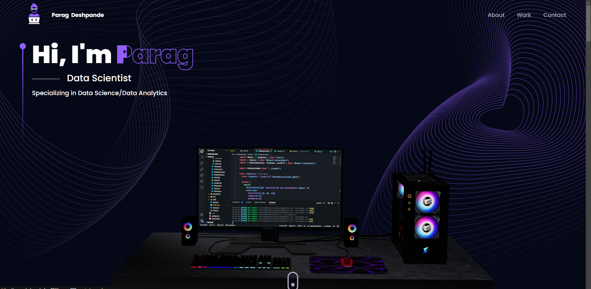

# 📌 Portfolio Website

A **modern and responsive portfolio website** built using **React & Vite**, designed to showcase my **Data Science projects**, technical skills, and achievements.

## 🚀 Live Demo

**Experience the project live:**  

<a href="https://parag-deshpande.vercel.app/" target="_blank">
  
</a>

---



## 📦 Installation

You can install the project dependencies by running:

```
npm install --legacy-peer-deps
```

### ⚡ Tech Stack Used in this Portfolio

- [React](https://reactjs.org/) – Component-based UI framework
- [Vite](https://vitejs.dev/) – Fast build tool for React
- [Tailwind CSS](https://tailwindcss.com/) – Utility-first CSS framework
- [Framer Motion](https://www.framer.com/motion/) – Animations for a dynamic UI
- [React Icons](https://react-icons.github.io/react-icons/) – Icon library for React
- [react-three-fiber](https://docs.pmnd.rs/react-three-fiber/getting-started/introduction) – 3D graphics rendering

---

### 🏃 Run the Project

Start a development server on `localhost:5173`:

```
 npm run dev
```

Build the project for production:

```
 npm run build
```

